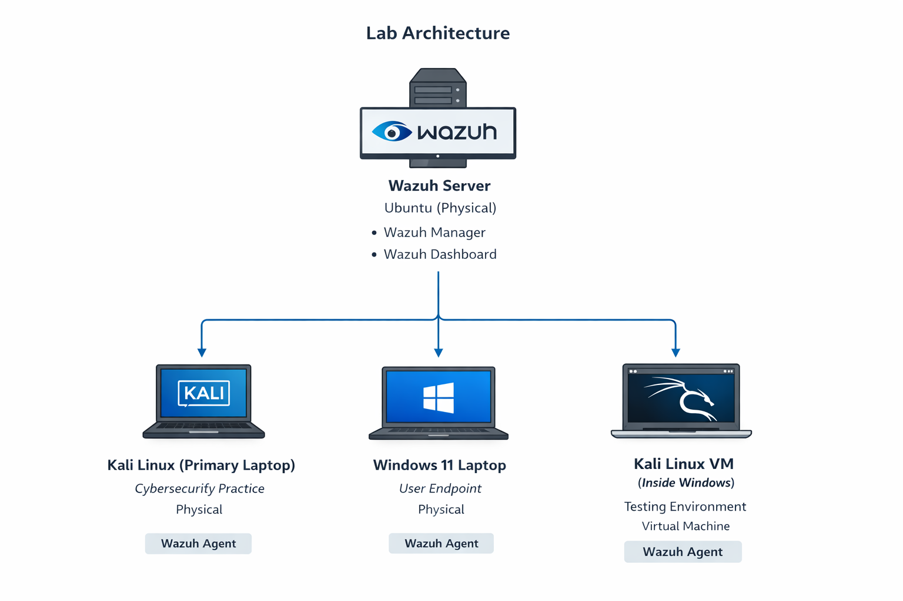
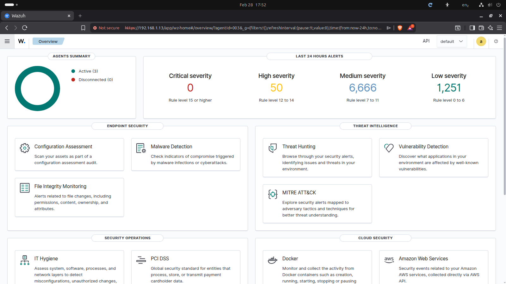
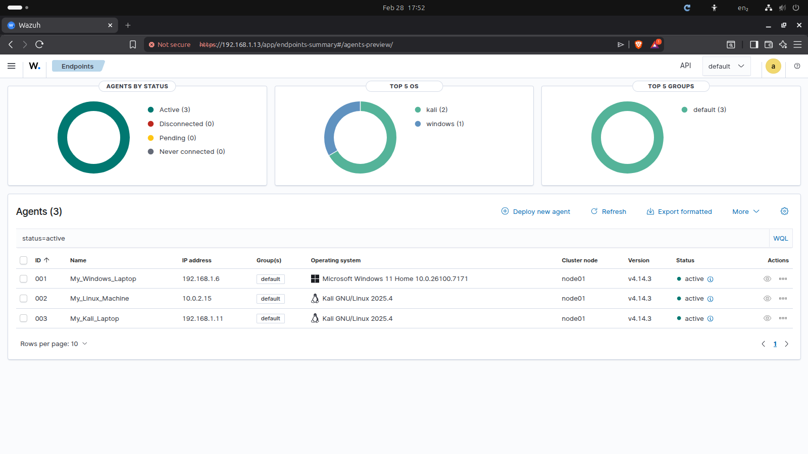
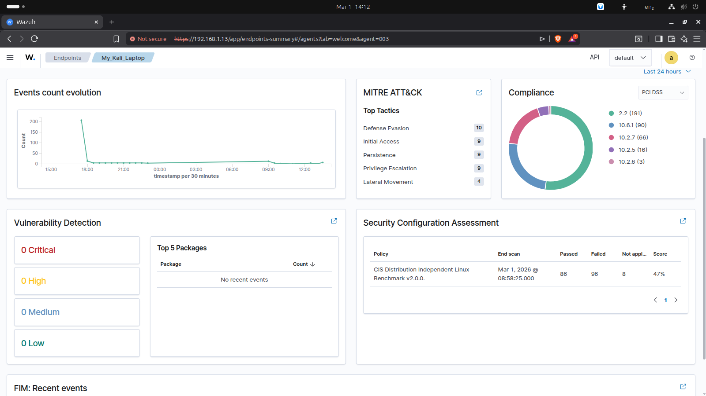
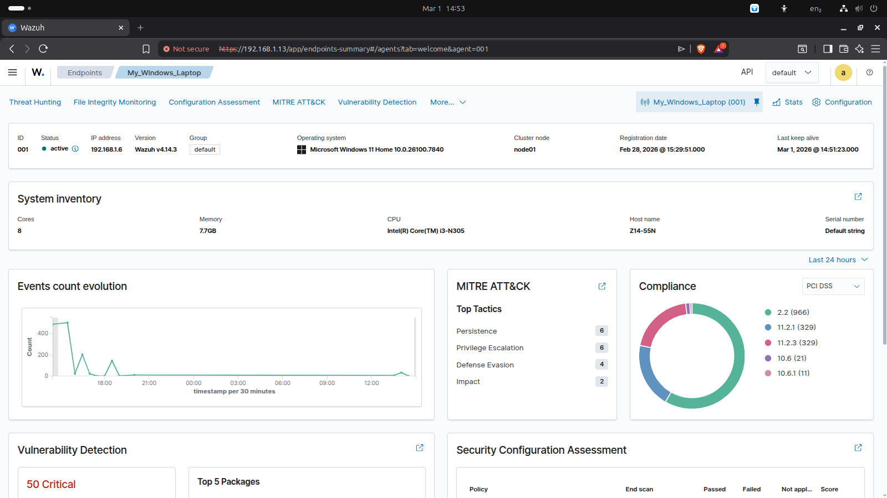
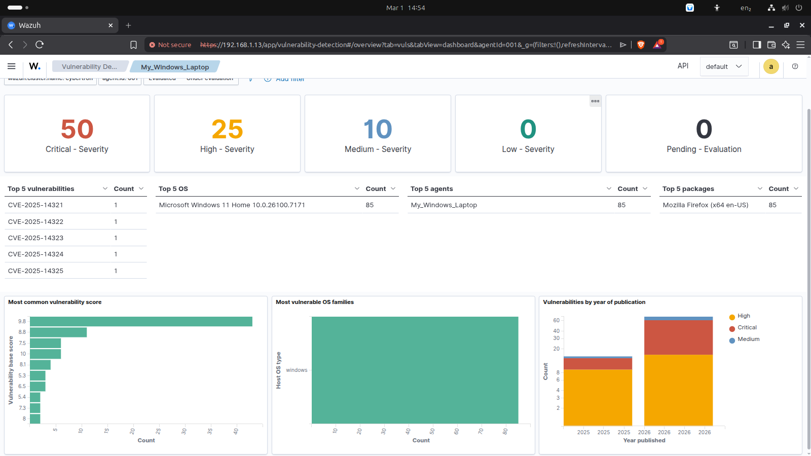
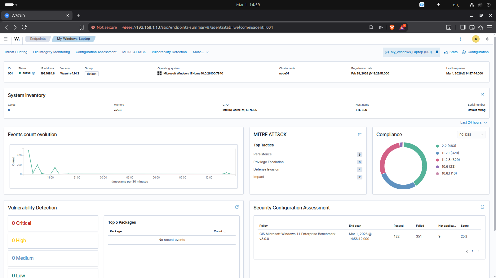
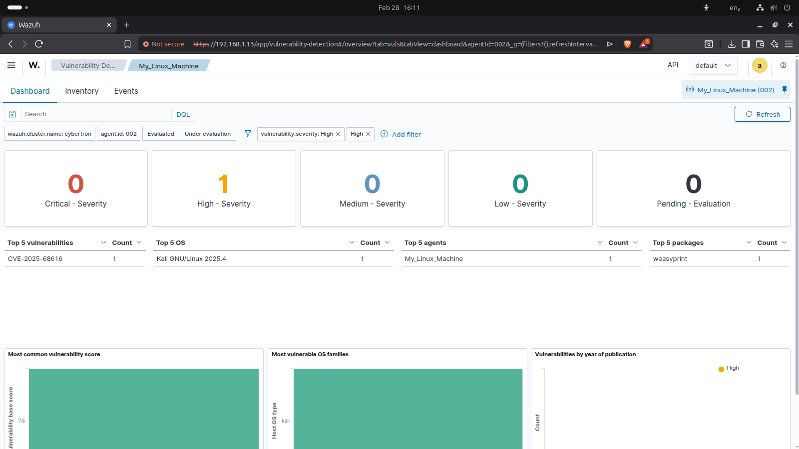

# Multi-Endpoint SOC Home Lab using Wazuh SIEM

## Overview

This project demonstrates the design and implementation of a **multi-endpoint Security Operations Center (SOC) home lab** using **Wazuh SIEM**. The lab simulates a real-world enterprise environment where multiple systems are centrally monitored for security events, vulnerabilities, and system activity.

The primary objective of this project is to gain hands-on experience in **SIEM operations, vulnerability management, and Blue Team practices**.

---

## Objectives

- Gain centralized visibility across multiple endpoints
- Detect vulnerabilities using CVE-based analysis
- Monitor system and security events in real time
- Perform risk analysis and remediation
- Understand real-world SOC workflows

---

## Lab Architecture

### Wazuh Server

- System: Personal Computer
- Operating System: Ubuntu
- Components Installed:
  - Wazuh Manager
  - Wazuh Dashboard
- Role: Centralized log collection, analysis, and alerting

---

### Monitored Endpoints

| Endpoint | Type | Purpose |
|---------|------|---------|
| Kali Linux (Primary Laptop) | Physical | Security learning and testing |
| Windows 11 Laptop | Physical | Real-world user activity monitoring |
| Kali Linux (Virtual Machine) | Virtual | Isolated testing environment |

All endpoints are configured with **Wazuh agents** to send logs and security events to the central server.

---

## Architecture Diagram





---

## Installation and Setup

### 1. Update Ubuntu System

```bash
sudo apt update && sudo apt upgrade -y
```

### 2. Install Wazuh Server

```bash
curl -sO https://packages.wazuh.com/4.14/wazuh-install.sh
sudo bash ./wazuh-install.sh -a
```

After installation, access the dashboard:

```
https://<WAZUH_SERVER_IP>:443
Username: admin
Password: <generated>
```

> Note: Self-signed certificate warnings are expected in local environments.

---

### 3. Deploy Wazuh Agents

Steps:

1. Open Wazuh Dashboard
2. Navigate to **Deploy New Agent**
3. Select endpoint operating system
4. Enter Wazuh server IP
5. Provide agent name
6. Copy and run the generated command on the endpoint
7. Start or restart the agent service

After a few moments, the agent status should appear as **Active**.

---

## Monitoring Capabilities

Once agents are connected, Wazuh provides:

- Vulnerability Detection (CVE-based)
- System Information and Inventory
- MITRE ATT&CK Mapping
- Compliance Monitoring
- Security Alerts and Event Logs
- File Integrity Monitoring (FIM)

---

## Results and Analysis

### 1. Kali Linux (Primary System)

| Severity | Count |
|---------|------|
| Critical | 0 |
| High | 0 |
| Medium | 0 |
| Low | 0 |

**Insight:** Regular system updates significantly reduce the attack surface.

---

### 2. Windows 11 Endpoint

**Initial Vulnerabilities**

| Severity | Count |
|---------|------|
| Critical | 50 |
| High | 25 |
| Medium | 10 |
| Low | 0 |

**Root Cause:** Outdated Mozilla Firefox

**Remediation:** Updated Firefox to the latest version

**Result:** Vulnerability count significantly reduced

**Insight:** Outdated applications are a major security risk and require regular patch management.

---

### 3. Kali Linux Virtual Machine

| Severity | Count |
|---------|------|
| Critical | 0 |
| High | 1 |
| Medium | 0 |
| Low | 0 |

**Cause:** Vulnerable `weasyprint` package  
**Remediation:** Package updated

**Insight:** Even isolated lab environments must be regularly patched.

---

## Screenshots

### Wazuh Dashboard


---

### Agent List


---

### Kali Linux (Primary Laptop) – No Vulnerabilities


---

### Windows 11 – Before Remediation



---

### Windows 11 – After Remediation


---

### Kali Linux Virtual Machine – Vulnerability Detected



---

## Key Takeaways

- Centralized monitoring improves endpoint visibility
- CVE-based detection helps prioritize risks
- Regular patching reduces the attack surface
- User endpoints typically carry the highest risk
- Virtual environments also require continuous security maintenance

---

## Skills Demonstrated

- Wazuh SIEM Deployment and Configuration
- Vulnerability Management
- CVE Analysis and Remediation
- Endpoint Monitoring and Log Analysis
- Linux System Administration
- Security Operations (SOC)
- Blue Team Practices

---

## Blog

Medium Article:

> https://medium.com/@dr.r.santhoshkumar/building-a-multi-endpoint-soc-home-lab-using-wazuh-siem-5270cf6d9440

---

## Repository Structure

```
wazuh-soc-home-lab/
│
├── README.md
├── architecture/
├── screenshots/
└── docs/
```

---

## Future Improvements

- Add Active Response use cases
- Integrate additional endpoints
- Simulate attack scenarios (Brute force, Malware, etc.)
- Deploy Wazuh in cloud environment
- Create automated incident response workflows

---

## Author

**Santhoshkumar**  
Cybersecurity Enthusiast | Blue Team Learner | SOC Analyst Aspirant

---

## Tags

`wazuh` `siem` `soc` `blueteam` `cybersecurity` `homelab` `vulnerability-management`
